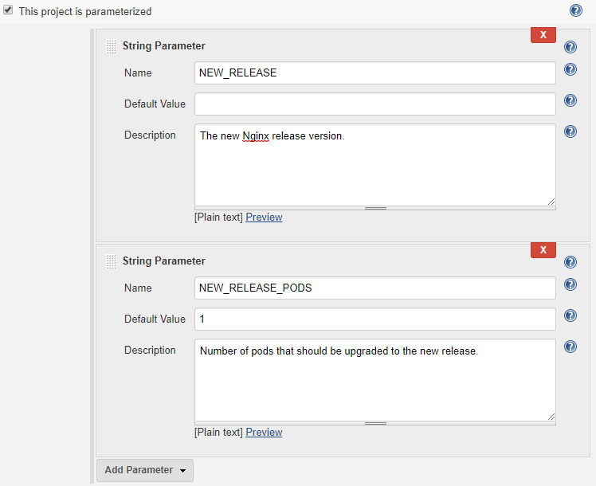
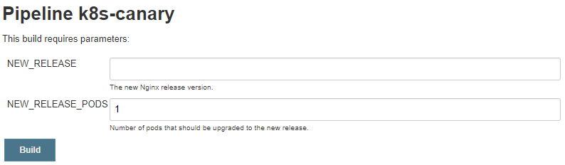

# Canary Deployment with Kubernetes

Canary deployment is a pattern that rolls out releases to a subset of users or servers. It deploys the changes to a
small set of servers, which allows you to test and monitor how the new release works before rolling the changes to the
rest of the servers.

Kubernetes is a popular Docker container orchestrator with clean and separated definition for deployments and services. A deployment represents the project runtime and a service is the publicly accessible endpoint. Kubernetes connects the two types of resources using labels and selectors. A deployment may be accessed from zero to many service endpoints, and at the same time a service may route the traffic to zero to many deployments (just like a load balancer.)

With this label-selector routing mechanism, it is easy to do canary deployment with Kubernetes:

1. Deploy the initial version of your application to Kubernetes (say, `deployment-A`), and deploy the service endpoint 
   that matches the label of `deployment-A`.

   This represents the initial state before we do the canary deployment.

1. Deploy the new version of your application to Kubernetes (say, `deployment-B`). It has the same label as required by
   the service endpoint (partially same with `deployment-A`).

1. Decrease the number of replicas in `deployment-A`, so that the replicas ratio of the initial release and the new 
   release matches the target.

   Now we are in a intermediate state where both new version and old version are serving the traffic.

1. When the new version of your application is validated to be working properly, we can make the full deployment by:

   1. Updating the number of replicas in `deployment-B` to the target number
   1. Deleting `deployment-A`

## Nginx Canary Deployment Example

We will demonstrate the canary deployment with Kubernetes using the public Nginx Docker image.

### Prepare the Initial Version

The initial state consists of a deployment of an old version of Nginx, and a service endpoint. This represents the initial
state of world we have before we start the canary deployment for the new version.

> Generally, for production applications, you will need to configure the [liveness and readiness probes](https://kubernetes.io/docs/tasks/configure-pod-container/configure-liveness-readiness-probes/), so that the frontend service
> only routes the traffic to the ready and live pods. To simplify the demos here, we didn't include
> the probes in our configuration. Please refer to the documentation for more details.

```sh
cat <<EOF >initial.yml
---
apiVersion: extensions/v1beta1
kind: Deployment
metadata:
  name: nginx-deployment-1.12
spec:
  replicas: 2
  template:
    metadata:
      labels:
        app: nginx
        deployment: canary
        version: "1.12"
    spec:
      containers:
      - name: nginx-container
        image: nginx:1.12
        ports:
        - containerPort: 80
---
kind: Service
apiVersion: v1
metadata:
  name: nginx-service
spec:
  type: LoadBalancer
  selector:
    app: nginx
    deployment: canary
  ports:
    - port: 80
      targetPort: 80
EOF
kubectl apply -f initial.yml
kubectl get services nginx-service --watch
# wait until the external-ip is provisioned for the service
```

Note that:

* The `selector` in the service spec matches the `labels` in the deployment spec.
* The `replicas` is set to `2` for the deployment, which is the target replicas count for our application.

   This means we may only have one replica for the old version, and one replica for the new version (1:1) if we want to
   preserve the target replicas count. In real world application, the `replicas` should be larger so as to offer more choices
   of replica ratio.

### Deploy the New Version

If we want to deploy a new version of Nginx server in canary deployment pattern, we can create another deployment where

* The deployment name is different from the initial deployment
* The image version is `nginx:1.13`
* The `labels` are matched by the `nginx-service` in the initial state. It has different value for label `version` compared
   to the initial deployment
* The `replicas` is set to 1, which is the target replicas count for the new version

```sh
cat <<EOF >deployment-1.13.yml
apiVersion: extensions/v1beta1
kind: Deployment
metadata:
  name: nginx-deployment-1.13
spec:
  replicas: 1
  template:
    metadata:
      labels:
        app: nginx
        deployment: canary
        version: "1.13"
    spec:
      containers:
      - name: nginx-container
        image: nginx:1.13
        ports:
        - containerPort: 80
EOF
kubectl apply -f deployment-1.13.yml
```

When the new deployment (`nginx-deployment-1.13`) is ready, some users should be able to see the web server served by
Nginx 1.13:

```sh
$ service_ip=$(kubectl get services nginx-service -o jsonpath='{.status.loadBalancer.ingress[0].ip}')
$ curl -is "$service_ip" | grep Server:
Server: nginx/1.12.2
$ curl -is "$service_ip" | grep Server:
Server: nginx/1.13.9
$ curl -is "$service_ip" | grep Server:
Server: nginx/1.12.2
$ curl -is "$service_ip" | grep Server:
Server: nginx/1.13.9
$ curl -is "$service_ip" | grep Server:
Server: nginx/1.12.2
```

To be more careful and conservative, we may first create the deployment with labels that cannot be matched by the
service endpoint, for example, set `deployment: canary-prepare` first, and then check if it is working properly:

```sh
pod=$(kubectl get pods -l 'version=1.13' -o jsonpath='{.items[0].metadata.name}')
kubectl port-forward "$pod" 8080:80
# now you can visit http://localhost:8080 to see if it is working properly
```

If the pods for the deployment is working, we can update the label of the deployment so that it can be matched by
the service endpoint.

### Update the Replicas Count

Now we have 3 working replicas, 2 on old version and 1 on new, and all of them may be accessed from the frontend
service `nginx-service`. If this is the desired state of the deployment, you may stop here.

If not, for example, we want to preserve the replicas count in the initial state, we can decrease the `replicas`
for the initial deployment `nginx-deployment-1.12`.

```sh
cat <<EOF >update-1.12.yml
apiVersion: extensions/v1beta1
kind: Deployment
metadata:
  name: nginx-deployment-1.12
spec:
  replicas: 1
  template:
    metadata:
      labels:
        app: nginx
        deployment: canary
        version: "1.12"
    spec:
      containers:
      - name: nginx-container
        image: nginx:1.12
        ports:
        - containerPort: 80
EOF
kubectl apply -f update-1.12.yml
```

### Full Deployment

When the new version is verified to be working, we can perform the full deployment. We just need to increase the
`replicas` in `nginx-deployment-1.13` to `2`, and then delete deployment `nginx-deployment-1.12`.

```sh
cat <<EOF >update-1.13.yml
apiVersion: extensions/v1beta1
kind: Deployment
metadata:
  name: nginx-deployment-1.13
spec:
  replicas: 2
  template:
    metadata:
      labels:
        app: nginx
        deployment: canary
        version: "1.13"
    spec:
      containers:
      - name: nginx-container
        image: nginx:1.13
        ports:
        - containerPort: 80
EOF
kubectl apply -f update-1.13.yml
# verify that all pods are up and working
kubectl delete deployment nginx-deployment-1.12
```

Now the users should only see the new version of your application.

## Canary Deployment with Jenkins

In canary deployment we may roll out new releases to the servers gradually, which may involve multiple deployments
that updates the old releases / new releases server ratio. This may not be suitable to automate in limited number
of Jenkins jobs.

However, if we simplify the process a bit so that the process becomes restrained and standardized, and we can model
the process with parameterized Jenkins jobs. We have published [Kubernetes Continuous Deploy](https://plugins.jenkins.io/kubernetes-cd)
and [Azure Container Service](https://plugins.jenkins.io/azure-acs) Jenkins plugins which helps the deployment to
generic Kubernetes cluster and [Azure Container Serivce (AKS)](https://azure.microsoft.com/en-us/services/container-service/)
respectively. They are helpful to build the Jenkins Pipeline for the deployment to Kubernetes or AKS.

Consider a simplified and standardized canary deployment process of the previous Nginx deployment example:

1. Initially, we have 2 pods serving the old Nginx version, say 1.12
1. Deploy Nginx 1.13 to half of the pods, that is, 1 pod (50%) running the new version 1.13 and 1 (50%) pod untouched
1. Test and ensure the new version is working properly on all pods
1. Deploy Nginx 1.13 to the rest pods (50%)
1. Test and ensure the new version is working properly on all pods

We can build Jenkins jobs to automate the canary deployment as described in step 2 to 4.

> In real world projects, we may extract more phases according to the business requirements, and fit them into
> Jenkins jobs.

### Preparation

To automate the deployments in Jenkins, we need the current release version and the new release version to provide
Jenkins with the status of the deployment process. We attach the information to the label section of the frontend service.
So initially, the Nginx service is provided by the following Kubernetes deployment and service:

* Deployment

   ```yaml
   apiVersion: extensions/v1beta1
   kind: Deployment
   metadata:
     name: nginx-deployment-1.12
   spec:
     replicas: 2
     template:
       metadata:
         labels:
           app: nginx
           deployment: canary
           version: "1.12"
       spec:
         containers:
         - name: nginx-container
           image: nginx:1.12
           ports:
           - containerPort: 80
   ```

* Service

   Initially, the service contains the label to identify the current release.

   ```yaml
   kind: Service
   apiVersion: v1
   metadata:
     name: nginx-service
     labels:
       current-release: "1.12"
       new-release: ""
   spec:
     type: LoadBalancer
     selector:
       app: nginx
       deployment: canary
     ports:
       - port: 80
         targetPort: 80
   ```

   During the canary deployment process, we update new release information to the service labels:

   ```yaml
   metadata:
     labels:
       current-release: "1.12"
       new-release: "1.13"
   ```

   And when all the pods are migrated to the new release, we update the service labels to reflect the update:

   ```yaml
   metadata:
     labels:
       current-release: "1.13"
       new-release: ""
   ```

With the metadata in the service labels, we can determine the current release status and proceed with the followed
deployment actions accordingly:

```sh
#!/bin/bash

# get the current release
current_release="$(kubectl get services nginx-service -o jsonpath='{.metadata.labels.current-release}')"

# get the new release
new_release="$(kubectl get services nginx-service -o jsonpath='{.metadata.labels.new-release}')"

# the deployment name of the current release
current_release_deployment="nginx-deployment-${current_release}"

# the deployment name of the new release, if new_release is not empty
new_release_deployment="nginx-deployment-${new_release}"
```

### Deploy New Release to a Given Number of Pods

We create a Pipeline job with the parameters:

* `NEW_RELEASE`: the new release being deployed
* `NEW_RELEASE_PODS`: number of pods that should be upgraded to the new release in this cycle



The Kubernetes deployment configuration (filename: `deployment.yml`) is defined as followed:

```yaml
apiVersion: extensions/v1beta1
kind: Deployment
metadata:
  name: nginx-deployment-${RELEASE}
spec:
  replicas: ${REPLICAS}
  template:
    metadata:
      labels:
        app: nginx
        deployment: canary
        version: "${RELEASE}"
    spec:
      containers:
      - name: nginx-container
        image: nginx:${RELEASE}
        ports:
        - containerPort: 80
```

and the service configuration (filename: `service.yml`) is defined as:

```yaml
   kind: Service
   apiVersion: v1
   metadata:
     name: nginx-service
     labels:
       current-release: "${CURRENT_RELEASE}"
       new-release: "${NEW_RELEASE}"
   spec:
     type: LoadBalancer
     selector:
       app: nginx
       deployment: canary
     ports:
       - port: 80
         targetPort: 80
```

The key change is that we added a few variables (`${VAR}`) in the deployment configuration. We will leverage
the variable substitution features provided by the Jenkins plugins (`kubernetes-cd` or `azure-acs`) to generate
the target deployment configuration before it is applied to the Kubernetes cluster.

We can define the Pipeline stages:

```groovy
node {
  // ...

  def kubeconfig = '/path/to/your/kubeconfig'

  stage('Parameters') {
    // Fetch the current release from the service label
    env.CURRENT_RELEASE = sh script: "kubectl get services nginx-service -o jsonpath='{.metadata.labels.current-release}' --kubeconfig '${kubeconfig}'", returnStdout: true
    // Get the replicas count of the current release
    def replicas = sh script: "kubectl get deployments nginx-deployment-1.12 -o jsonpath='{.spec.replicas}' --kubeconfig '${kubeconfig}'", returnStdout: true
    // Calculate the target replicas count for the current release
    env.CURRENT_RELEASE_PODS = replicas.toInteger() - env.NEW_RELEASE_PODS.toInteger()
  }

  stage('Deploy New Release') {
    withEnv(["RELEASE=${env.NEW_RELEASE}", "REPLICAS=${env.NEW_RELEASE_PODS}"]) {
      kubernetesDeploy kubeConfig: [path: kubeconfig], configs: 'deployment.yml'
    }
  }

  stage('Reduce Current Release Pods') {
    withEnv(["RELEASE=${env.CURRENT_RELEASE}", "REPLICAS=${env.CURRENT_RELEASE_PODS}"]) {
      kubernetesDeploy kubeConfig: [path: kubeconfig], configs: 'deployment.yml'
    }
  }

  stage('Update Service Labels') {
    // NEW_RELEASE is defined by the job parameters, and CURRENT_RELEASE is defined in Parameters stage 
    kubernetesDeploy kubeConfig: [path: kubeconfig], configs: 'service.yml'
  }

  // ...
}
```

We can build the job with the new release parameter, and optionally, the pod count for the new release.
The parameters can be either specified from the Jenkins web UI, or you can trigger the build programmatically
using the [Jenkins CLI](https://jenkins.io/doc/book/managing/cli/#build).



When the build completes, you can start your testing against the new release.

### Deploy the New Release to the Rest of Pods

When the new release is verified to be working, we can roll the new release to the rest of pods and decomission
the pods running the old release. As we have the release number for both version in the service labels, we can
define another Pipeline job as:

```groovy
node {
  // ...

  def kubeconfig = '/path/to/your/kubeconfig'

  stage('Parameters') {
    // Fetch the current release from the service label
    env.CURRENT_RELEASE = sh script: "kubectl get services nginx-service -o jsonpath='{.metadata.labels.current-release}' --kubeconfig '${kubeconfig}'", returnStdout: true
    if (!env.CURRENT_RELEASE) {
      error("Cannot fetch the current release info")
    }
    // Fetch the current release from the service label
    env.NEW_RELEASE = sh script: "kubectl get services nginx-service -o jsonpath='{.metadata.labels.current-release}' --kubeconfig '${kubeconfig}'", returnStdout: true
    if (!env.NEW_RELEASE) {
      error("Cannot fetch the new release info")
    }
    // Get the replicas count of the current release
    def current_replicas = sh script: "kubectl get deployments 'nginx-deployment-${env.CURRENT_RELEASE}' -o jsonpath='{.spec.replicas}' --kubeconfig '${kubeconfig}'", returnStdout: true
    // Get the replicas count of the new release
    def new_replicas = sh script: "kubectl get deployments 'nginx-deployment-${env.NEW_RELEASE}' -o jsonpath='{.spec.replicas}' --kubeconfig '${kubeconfig}'", returnStdout: true
    // The target replicas count
    env.NEW_RELEASE_PODS = current_replicas.toInteger() + new_replicas.toInteger()
  }

  stage('Deploy New Release') {
    withEnv(["RELEASE=${env.NEW_RELEASE}", "REPLICAS=${env.NEW_RELEASE_PODS}"]) {
      kubernetesDeploy kubeConfig: [path: kubeconfig], configs: 'deployment.yml'
    }
  }

  stage('Delete the Current Release') {
    sh "kubectl delete deployments 'nginx-deployment-${env.CURRENT_RELEASE}' --kubeconfig '${kubeconfig}'"
  }

  stage('Update Service Labels') {
    // NEW_RELEASE is defined by the job parameters, and CURRENT_RELEASE is defined in Parameters stage 
    withEnv(["CURRENT_RELEASE=${env.NEW_RELEASE}"]) {
      env.NEW_RELEASE = ''
      kubernetesDeploy kubeConfig: [path: kubeconfig], configs: 'service.yml'
    }
  }

  // ...
}
```

### Additional Work

The above Jenkins Pipelines provide the basic for how we can do canary deployment to Kubernetes with multiple Jenkins jobs.
It does not include error handling nor testing. If you want to use Jenkins
for canary deployment, you should add extra logic to determine the full status
of the deployment; handle possible deployment errors; roll back if necessary; and inject tests in between key steps
before proceeding with the subsequent steps. This will be project specific and not covered in this blog.
