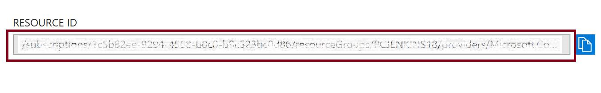

# Disaster Recovery for solution template (Managed Disk)

Jenkins persists all the configurations, plugins and logs in JENKINS_HOME. This script lists one by one steps to help you move JENKINS_HOME to another disk called `dataDisk`. Once your Jenkins instance break down, you can detach `dataDisk` from the original Jenkins instance and attach to a new Jenkins instance to achieve disaster recovery.

## Persist JENKINS_HOME on dataDisk

Add new data disk to VM

        az login
        az vm disk attach -g resourceGroup --disk dataDisk --vm-name Jenkins --new --size-gb 50 --caching ReadWrite --sku Premium_LRS

Connect to VM via SSH

        ssh admin@IP

Initialize new disk for the first time

        dmesg | grep SCSI
        sudo fdisk /dev/sdc
        n
        p # primary
        1 # Partition number
          # default first sector  
          # default last sector
        w # save and exit
        sudo mkfs -t ext4 /dev/sdc1

Move JENKINS_HOME from osDisk to dataDisk

        # mount dataDisk to /data
        sudo mkdir /data && \
        sudo mount /dev/sdc1 /data

        # move JENKINS_HOME to dataDisk and then replace it
        sudo cp -R /var/lib/jenkins/* /data && \
        sudo chown -R jenkins:jenkins /data && \
        sudo umount /data && \
        sudo mount /dev/sdc1 /var/lib/jenkins

Run scripts below to add lines in `/etc/fstab` to ensure remount drive automatically after a reboot

        UUID=$(sudo -i blkid | grep /dev/sdc1* | awk '{print $2}' | sed "s/\"//g") && \
        sudo sh -c "echo '${UUID}   /var/lib/jenkins   ext4   defaults,nofail   1   2'>>/etc/fstab"

## Reuse Jenkins configurations on other instance

Detach disk from origin Jenkins and attach to new Jenkins

        az vm disk detach -g myResourceGroup --vm-name Jenkins -n dataDisk

        az vm disk attach -g resourceGroup --disk dataDiskId --vm-name newJenkins --caching ReadWrite

Note: You can find your dataDiskId in Azure Portal -> dataDisk -> Overview -> RESOURCE ID

Mount to JENKINS_HOME and add to /etc/fstab

        sudo mount /dev/sdc1 /var/lib/jenkins

        UUID=$(sudo -i blkid | grep /dev/sdc1* | awk '{print $2}' | sed "s/\"//g") && \
        sudo sh -c "echo '${UUID}   /var/lib/jenkins   ext4   defaults,nofail   1   2'>>/etc/fstab"

Restart Jenkins from UI or use commond

        sudo /etc/init.d/jenkins restart
